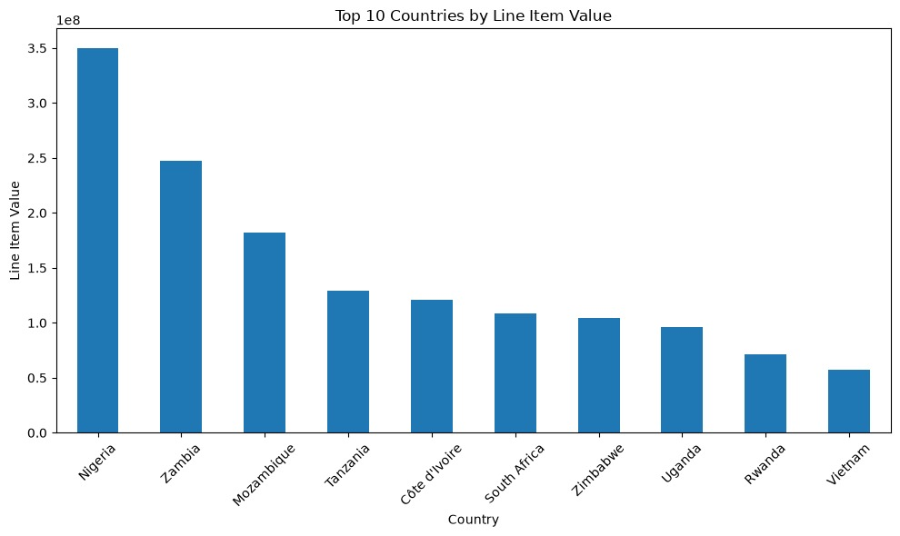
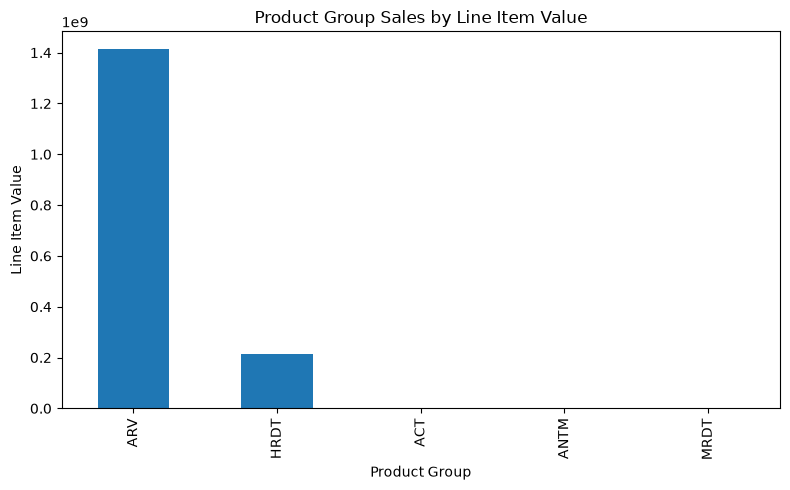
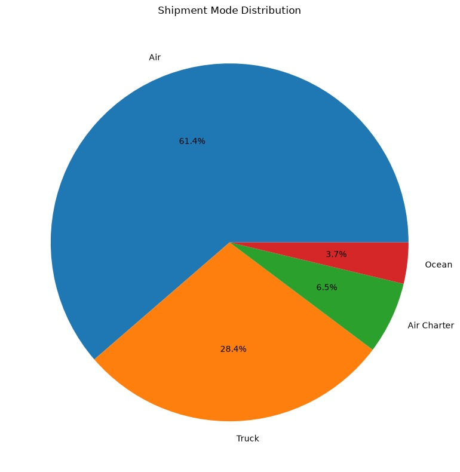
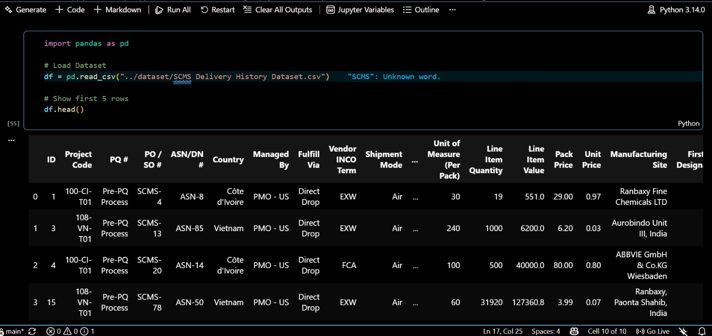
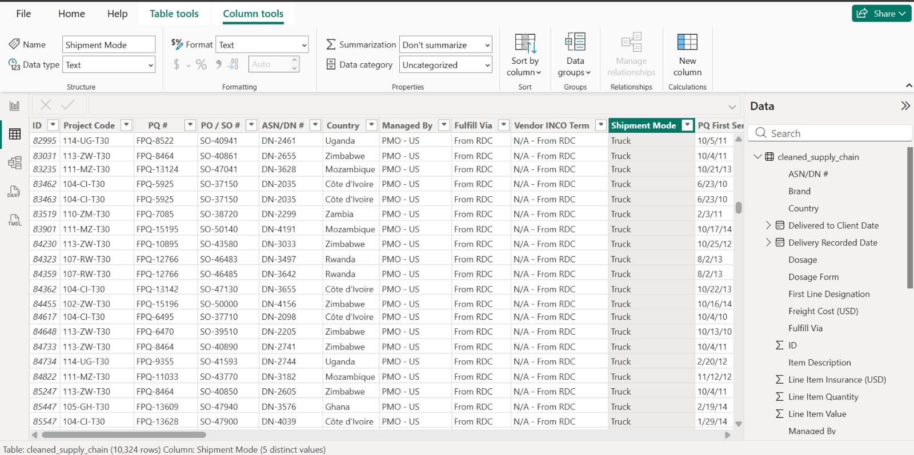
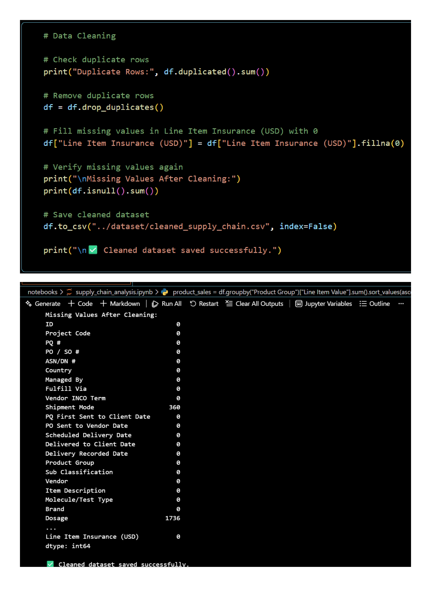
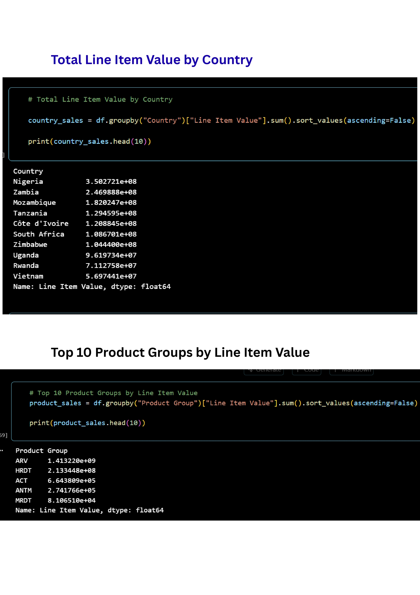
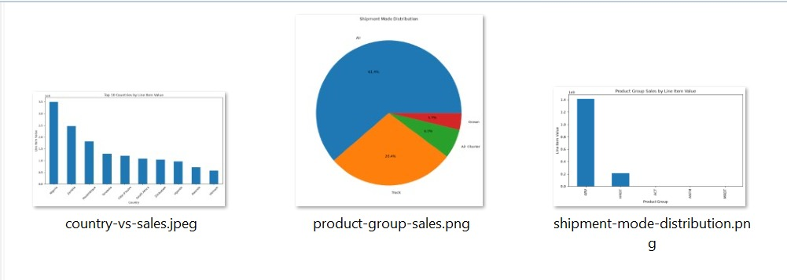
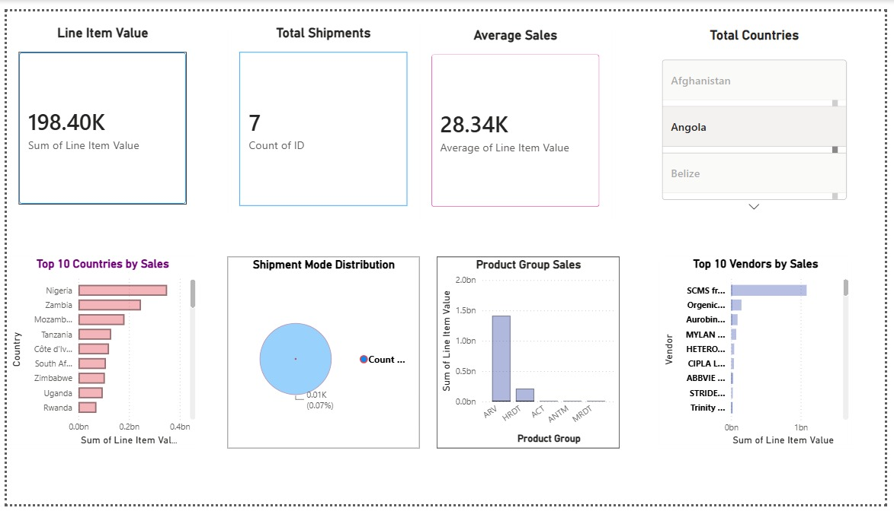
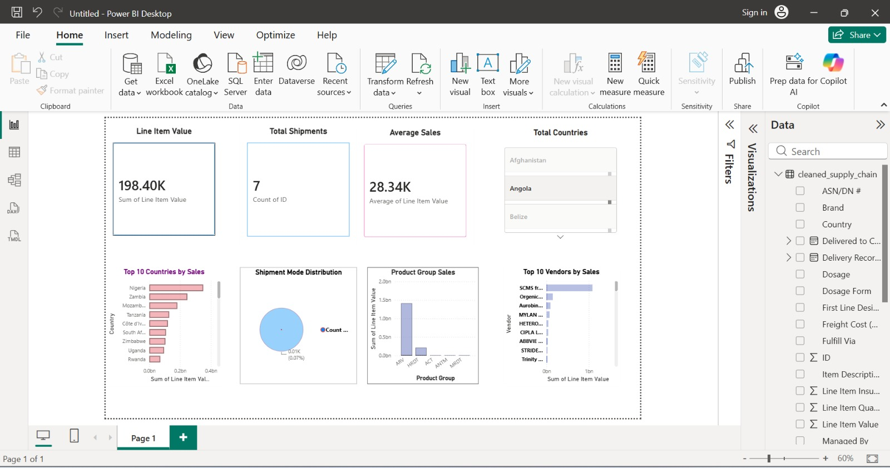

<div align="center">


<br/>


<br/>

[](#)
[](#)
[](#)
[](#)
[](#)
[](#)
[](#)

[](#)
[](#)
[](#)
[](#)
[](#)
[](#license)

</div>

<br/>

---

## 📌 Project Overview

This repository contains my **Week 3 Task** for the **Data Analyst Internship at Logic Stack**, centred on **Supply Chain Analytics** using Python and Power BI.

The project involves working with a real-world SCMS (Supply Chain Management System) dataset of **10,324 shipments** across multiple countries, vendors and product groups. The full pipeline — from raw messy data through to an interactive Power BI dashboard — is implemented end to end, building directly on the Excel and Power BI foundations from Weeks 1 and 2.

> 💼 **Internship:** Logic Stack — Data Analysis Internship (Jul 2026)

> 🧩 **Task:** Week 3 — Supply Chain Analytics Challenge

> 🛠️ **Tools:** Python (Pandas, NumPy, Matplotlib, Seaborn) + Power BI Desktop


> 📂 **Dataset:** SCMS Delivery History (10,324 rows × 33 columns)

---

## 🎓 Internship Information

| Detail | Description |
|---|---|
| 🏢 **Company** | Logic Stack |
| 👨‍💻 **Role** | Data Analyst Intern |
| 📅 ** Task** |     Task 03 |
| 🔗 **Builds On** | [Week 1 — Excel Analysis](https://github.com/YasirAwan4831/week-1-retail-sales-excel-analysis) · [Week 2 — Excel + Power BI](https://github.com/YasirAwan4831/week-2-excel-powerbi-sales-dashboard) |
| 💻 **Project Type** | Python EDA + Power BI Dashboard |
| ⏱️ **Duration** | 7 Days |
| 🧠 **Skills Learned** | Python, Pandas, EDA, Data Cleaning, Power BI, DAX, Dashboard Design |
| 📦 **Deliverables** | Jupyter Notebook · Cleaned CSV · Python Charts · Power BI Dashboard |

---

## 🎯 Project Objectives

- ✔ **Data Cleaning** — Convert date columns, handle missing values, fix numeric columns stored as text
- ✔ **Data Preparation** — Export a fully cleaned CSV ready for Power BI import
- ✔ **Exploratory Data Analysis** — Shipment patterns, delivery delays, cost breakdowns
- ✔ **Group-Based Analysis** — Country, Vendor, Product Group, Shipment Mode
- ✔ **Business Insights** — 5 Python insights + 3 Power BI insights + 2 recommendations
- ✔ **Data Visualization** — 3 Python charts (Bar, Pie, Line)
- ✔ **Power BI Dashboard** — KPI Cards + 4 interactive visuals

---

## 🛠️ Technologies Used

<div align="center">

| Technology | Purpose |
|---|---|
|  | Core analysis language |
|  | Data loading, cleaning, grouping |
|  | Numeric operations |
|  | Charts and visualizations |
|  | Interactive notebook environment |
|  | KPI Dashboard and interactive visuals |
|  | Development environment |
|  | Version control and portfolio |

</div>

---

## 🗂️ Dataset Information

| Field | Detail |
|---|---|
| **Dataset Name** | SCMS Delivery History Dataset |
| **Rows** | 10,324 shipments |
| **Columns** | 33 features |
| **File Format** | CSV |
| **Business Domain** | Supply Chain / Logistics |
| **Date Range** | 2006 – 2015 |
| **Main Features** | Country, Vendor, Shipment Mode, Freight Cost, Delivery Dates, Product Group, Line Item Value |

---

## 📁 Folder Structure

```text
week-3-python-powerbi-supply-chain-analytics/
│
├── charts/
│   ├── country-vs-sales.jpeg
│   ├── product-group-sales.png
│   └── shipment-mode-distribution.png
│
├── dataset/
│   ├── SCMS Delivery History Dataset.csv
│   └── cleaned_supply_chain.csv
│
├── notebooks/
│   └── supply_chain_analysis.ipynb
│
├── powerbi/
│   ├── Supply_Chain_Dashboard.pbix
│   ├── powerbi-dashboard.jpeg
│   └── fullpbi-dashboard.jpeg
│
├── screenshots/
│   ├── dataset-loaded.png
│   ├── dataset-loaded-in-CSV.jpeg
│   ├── dataset-load-processing-in-CSV.jpg
│   ├── data-cleaning-output.jpg
│   ├── eda-analysis-output.jpg
│   ├── python-charts-output.png
│   └── final-dashboard.jpeg
│
├── .gitignore
├── LICENSE
└── README.md
```

---

## 🔄 Python Workflow

```
📥 Load Dataset          →   pandas.read_csv() with latin1 encoding

🔍 Inspect Data          →   .shape, .dtypes, .head(10), .columns

🧹 Clean Date Columns    →   pd.to_datetime() on 5 date columns

🔢 Fix Numeric Columns   →   pd.to_numeric(errors='coerce') → fill with median

❌ Handle Missing Values →   Mode fill (Shipment Mode) · "Not Specified" (Dosage) · 0 (Insurance)

📊 EDA                   →   Country, Vendor, Product Group, Shipment Mode breakdowns

⏱️  Delivery Analysis     →   Delay = Delivered Date − Scheduled Date

💡 Business Insights     →   5 key findings documented

📈 Visualizations        →   3 charts saved to charts/ folder

💾 Export                →   cleaned_supply_chain.csv → used in Power BI

```

---

## 🧹 Data Cleaning Summary

| Step | Issue | Action |
|---|---|---|
| Date Columns (5) | Stored as text strings | Converted with `pd.to_datetime()` |
| Freight Cost (USD) | Text values like "Freight Included…", "See ASN-xxx" | `pd.to_numeric(errors='coerce')` → filled with median |
| Weight (Kilograms) | Same text issues | `pd.to_numeric(errors='coerce')` → filled with median |
| Shipment Mode | 360 missing values | Filled with most common value (Air) |
| Dosage | 1,736 missing values | Filled with "Not Specified" |
| Line Item Insurance | 287 missing values | Filled with 0 |
| Cleaned Export | — | Saved as `cleaned_supply_chain.csv` |

---

## 🔍 Exploratory Data Analysis

### 🌍 Country Analysis
- South Africa leads with **1,406 shipments**, followed by Nigeria (1,194) and Côte d'Ivoire (1,083)

- Africa dominates the destination geography

- top 10 countries are all African nations

### 📦 Product Group Analysis
- **ARV** (Antiretroviral) is the dominant product group — 8,550 shipments (82.8% of total)

- ARV also accounts for the majority of total line item value

### 🚢 Shipment Analysis
- **Air** is the most used mode with 6,113 shipments (~59%) — speed prioritised over cost

- **Truck** is second with 2,830 shipments (~27%)

- Ocean and Air Charter make up the remaining ~14%

### 🏭 Vendor Analysis
- Freight costs vary significantly across vendors

- A small number of high-cost vendors account for a disproportionate share of total freight spend

---

## 📈 Python Charts

### 🌍 Country vs Total Shipments

<div align="center">



*Top countries by total shipment volume — South Africa leads the supply chain destination list*

</div>

---

### 📦 Product Group vs Sales

<div align="center">

| Shipment Mode Distribution | Product Group Sales |
|:---:|:---:|
|  |  |
| *Air freight dominates at ~59% of all shipments* | *ARV accounts for the majority of supply chain value* |

</div>

---

## 🖥️ Notebook Screenshots

### Dataset Loading

<div align="center">

| Dataset Loaded in Python | Dataset Loaded from CSV |
|:---:|:---:|
|  |  |

</div>

---

### Data Cleaning & EDA

<div align="center">

| Data Cleaning Output | EDA Analysis Output |
|:---:|:---:|
|  |  |

</div>

---

### Python Charts Output

<div align="center">



*All three Python charts generated and saved to the charts/ folder*

</div>

---

## 📊 Power BI Dashboard

### Supply Chain Performance Dashboard

<div align="center">



</div>

---

<div align="center">



</div>

### 🃏 KPI Cards

| KPI | Description |
|---|---|
| 📦 **Total Shipments** | Total number of supply chain deliveries |
| 💰 **Total Freight Cost** | Sum of all freight costs across shipments |
| ⏱️ **Average Delivery Delay** | Mean delay (days) between scheduled and actual delivery |
| 💵 **Total Line Item Value** | Cumulative value of all line items |

### 📉 Dashboard Visuals

| Visual | Type | Insight |
|---|---|---|
| Country vs Shipments | Horizontal Bar Chart | Top destination countries |
| Shipment Mode Distribution | Pie Chart | Air dominates at 59% |
| Monthly Delivery Trend | Line Chart | Delivery volume over time |
| Vendor vs Freight Cost | Column Chart | Top 10 vendors by cost |

---

## 💡 Key Business Insights

**From Python Analysis:**

1. 🌍 **South Africa** is the most active supply chain destination with 1,406 shipments — targeted logistics investment here would yield the highest return

2. ✈️ **Air freight** accounts for ~59% of all shipments, reflecting a speed-over-cost priority in this supply chain

3. 💊 **ARV products** dominate the supply chain at 82.8% of total volume — the entire operation effectively revolves around this single product group

4. 💰 **Freight cost variability** across vendors is significant — renegotiating contracts with the top 3 high-cost vendors could reduce overall logistics spend

5. ⏱️ A notable portion of shipments experience delivery delays — Ocean and Truck modes show the highest average delays

**From Power BI Dashboard:**

6. 📊 The KPI panel instantly surfaces that freight costs are concentrated in a small subset of vendors and routes
7. 📅 The monthly delivery trend reveals seasonal patterns that could inform future procurement planning
8. 🏆 South Africa, Nigeria, and Côte d'Ivoire together account for over 35% of all shipments — consolidating shipments to these corridors could drive cost efficiencies

**Business Recommendations:**

> 🔴 **Recommendation 1:** Shift a portion of Air freight to Ocean for non-urgent ARV shipments to meaningfully reduce the total freight cost burden without impacting critical delivery timelines.

> 🟡 **Recommendation 2:** Implement a vendor performance scorecard ranking vendors by cost efficiency and on-time delivery rate — prioritise top-performing vendors and phase out consistently high-cost, low-reliability partners.

---

## ⚠️ Challenges Faced

The most significant challenge in this project was **setting up and configuring the Python development environment** from scratch — a critical practical skill that no tutorial fully prepares you for.

| Challenge | Details |
|---|---|
| 🔴 Python Kernel Connection | Jupyter notebook kernel failed to connect in VS Code — required manual interpreter path configuration |
| 🟡 Library Installation | `pip install pandas`, `numpy` and `matplotlib` encountered permission and path conflicts |
| 🟡 VS Code Interpreter | Python interpreter had to be manually selected and verified in VS Code settings |
| 🟠 Library Compatibility | Version conflicts between installed packages required environment-level fixes |
| 🟡 Jupyter Environment | `.ipynb_checkpoints` folder conflicts and notebook state issues during development |
| 🟢 Resolution | All issues resolved through systematic troubleshooting — environment now fully stable |

> 💬 **Takeaway:** Debugging environment issues is a real-world data analyst skill. Successfully resolving these problems independently added significant practical value beyond the analysis itself.

---

## 📚 Learning Outcomes

| Skill | What I Learned |
|---|---|
| 🐍 **Python** | Writing structured, well-commented analysis code |
| 🐼 **Pandas** | Data loading, cleaning, groupby analysis, date operations |
| 📊 **EDA** | Systematic exploratory analysis of a complex real-world dataset |
| 💡 **Business Analysis** | Translating raw data findings into actionable recommendations |
| 📈 **Power BI** | DAX columns, KPI cards, interactive dashboard design |
| 🎨 **Dashboard Design** | Layout principles, visual hierarchy, colour consistency |
| 🔧 **Problem Solving** | Debugging environment issues, handling messy real-world data |
| 🐙 **GitHub** | Professional repository structure, documentation and portfolio presentation |

---

##  Future Improvements

- 🔄 Automate the cleaning pipeline using a reusable Python script (`clean.py`)

- 🧮 Add advanced **DAX measures** in Power BI for YoY comparison and running totals
- 🗄️ Connect Power BI directly to a **SQL database** via live query instead of CSV
- 🤖 Build a **predictive delay model** using scikit-learn to flag at-risk shipments before dispatch
- 📅 Add **time intelligence** analysis — quarterly and seasonal delivery trends
- 📤 Schedule automated Power BI refresh via **Power BI Service**

---

## 🔗 Complete Internship Journey

| Week | Repository | Focus Area |
|---|---|---|
| **Week 1** | [week-1-retail-sales-excel-analysis](https://github.com/YasirAwan4831/week-1-retail-sales-excel-analysis) | Excel · Data Cleaning · Formulas · Charts |
| **Week 2** | [week-2-excel-powerbi-sales-dashboard](https://github.com/YasirAwan4831/week-2-excel-powerbi-sales-dashboard) | Pivot Tables · KPIs · Power BI Dashboard |
| **Week 3** | `week-3-python-powerbi-supply-chain-analytics` *(current)* | Python · EDA · Supply Chain Analytics · Power BI |

---

## 👨‍💻 About the Author

<br/>


<br/>

**Muhammad Yasir** is a **Full Stack Web Developer, Data Analyst and AI Automation Enthusiast** passionate about building scalable web applications, data-driven solutions, automation systems and modern software products with clean architecture and outstanding user experience.

<br/>

[](https://github.com/YasirAwan4831)
[](https://www.linkedin.com/in/yasirawan4831)
[](https://yasirawaninfo.vercel.app)
[](mailto:my3154831409@gmail.com)

<br/>


<br/>

---

### ⭐ Support This Project

Please consider giving this repository a **Star** if you found it helpful.

<br/>

[](https://github.com/YasirAwan4831)

<br/>

---

<p align="center">
Crafted with precision and passion by <strong><a href="https://yasirawaninfo.vercel.app/" target="_blank">Muhammad Yasir</a></strong><br/>
Full Stack Web Developer • Data Analyst • AI & Automation Enthusiast • Open Source Contributor
</p>

